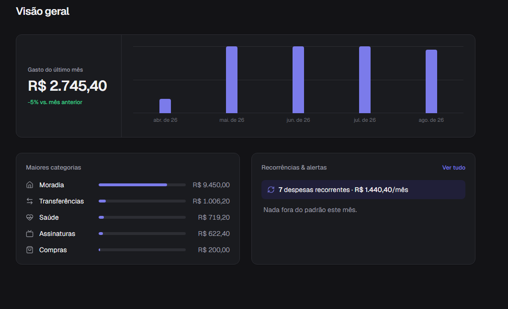
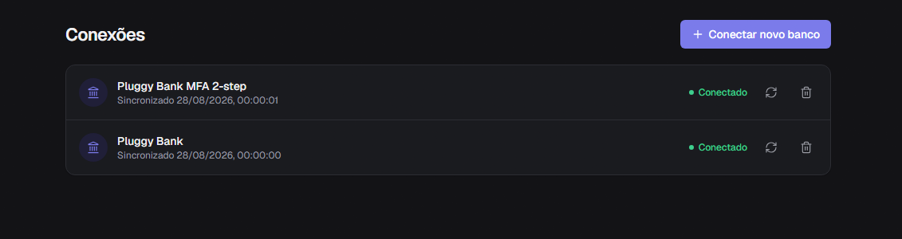

# MoneyLens

A personal-finance MVP that connects **sandbox** bank accounts through an Open Finance
aggregator (Pluggy), automatically categorizes every transaction, and
surfaces insights — spending trends, recurring subscriptions, and anomalies — that
are hard to spot by scrolling through a raw statement.

<p align="center">
  
</p>
<p align="center">
  
</p>

## What it does

- **Connects a bank without ever touching a password.** The Pluggy Connect widget
  runs in an iframe on Pluggy's own domain — bank credentials never pass through
  MoneyLens's servers.
- **Syncs accounts and transactions asynchronously.** Initial sync and every
  webhook-triggered update run as background jobs (BullMQ), never inside an HTTP
  request.
- **Categorizes automatically, in layers.** A merchant cache, ~80 deterministic
  rules, Pluggy's own merchant category, and an optional Google Gemini fallback.
  Gemini is disabled by default; it can be enabled only with synthetic sandbox data.
- **Detects recurring expenses and spending anomalies** using plain statistical
  heuristics (interval/amount regularity, mean + standard deviation), not ML.
- **Isolates each user’s data.** The connection token carries a server-side user
  marker, category changes do not affect the shared merchant cache, and sensitive
  provider payloads are not returned by the API.

## Stack

| Layer | Technology | Why |
|---|---|---|
| Backend | NestJS + TypeScript | Modular structure (modules, guards, DI) for a domain with many moving parts — auth, sync, webhooks, categorization, insights. |
| Frontend | Next.js 16 (App Router) | Full-stack TypeScript, `proxy.ts` for optimistic session redirects without a separate BFF layer. |
| Database | PostgreSQL + Prisma | `Decimal` for money, typed client, versioned migrations across ~15 related models. |
| Queues | Redis + BullMQ | Sync, webhook processing, and LLM calls can't block an HTTP response — background jobs with retry/backoff. |
| Open Finance | [Pluggy](https://pluggy.ai) (sandbox) | Brazilian aggregator with a free sandbox — no need to integrate Open Finance Brasil directly for a personal project. |
| Categorization | Rules + optional Google Gemini | Deterministic rules resolve most cases; the LLM fallback remains off by default. |
| Local tunnel | ngrok | Exposes the local API so Pluggy's sandbox can deliver real webhooks during development. |
| UI | Tailwind CSS v4 + lucide-react | Token-based theming (light/dark), real icons, a product-style sidebar layout. |

## Architecture

```
Browser ──▶ Next.js (:3000) ──▶ NestJS API (:3001) ──▶ PostgreSQL
                │                       │
                │                       ├──▶ Redis / BullMQ ──▶ Workers (sync · webhook · categorization)
                │                       │                              │
                └──▶ Pluggy Connect     ├──▶ Pluggy API (sandbox) ◀───┘
                    (iframe, never      └──▶ Gemini API (external, categorization fallback)
                     touches our API)

Pluggy ──── webhook (new data available) ────▶ ngrok tunnel ──▶ NestJS API
```

Three things matter here: the bank-connection widget never talks to MoneyLens's
backend; anything slow or fallible (sync, categorization) is a queued job, never
part of a request/response cycle; and Pluggy — not MoneyLens — initiates the
webhook conversation when new data is ready.

## Getting started

### Prerequisites

- Node.js 24 (see `.nvmrc`), Docker Desktop
- A [Pluggy](https://dashboard.pluggy.ai) sandbox app (Client ID + Secret)
- A [Google Gemini](https://aistudio.google.com/apikey) API key
- [ngrok](https://ngrok.com) (for receiving real Pluggy webhooks locally)

### Setup

```bash
npm install

cp .env.example .env
# fill in DATABASE_URL, JWT secrets, PLUGGY_CLIENT_ID/SECRET, etc.

docker compose up -d postgres redis

npm run prisma:migrate
npm run prisma:seed

npm run dev:api    # http://localhost:3001 (Swagger at /api/docs)
npm run dev:web    # http://localhost:3000
```

To receive real Pluggy webhooks locally, run `ngrok http 3001`, set
`PLUGGY_WEBHOOK_URL` in `.env` to the resulting HTTPS URL, and restart the API —
it registers the webhook with Pluggy automatically on boot.

The Pluggy sandbox connector ("Pluggy Bank") accepts the test credentials
`user-ok` / `password-ok` for a successful connection, and a set of other
`user-*` values to simulate specific failure scenarios (locked account, MFA,
connection errors, and so on).

## Project structure

```
apps/
  api/    NestJS backend — auth, Pluggy integration, sync, webhooks,
          categorization, insights
  web/    Next.js frontend — dashboard, connections, transactions, insights
docker-compose.yml   Postgres + Redis for local development
```

## MVP safety and limitations

This repository is a portfolio project, intended only for the Pluggy sandbox and
synthetic credentials. Do not use it with real financial data or treat the
insights as financial advice.

- The browser never receives Pluggy credentials; it receives a short-lived Connect
  Token, bound to the signed-in MoneyLens user.
- API sessions use `HttpOnly`, `Secure` production cookies. Refresh-token rotation
  is atomic, and failed refreshes clear the local cookies.
- Webhooks require a secret in production, are validated before persistence, and
  are deduplicated by the provider event ID.
- Account and transaction endpoints omit the stored raw provider payload.
- “Monthly recurring total” is a 30-day estimate. Dashboard totals are BRL
  outflows and can include transfers or card payments; they are not a complete
  accounting statement.
- The app retains raw provider payloads, webhook events, sync logs, and session
  records. A real product needs a formal retention/deletion policy, monitoring,
  backups, privacy review, and a dependency upgrade plan.
- Free Gemini usage can have different data-handling terms. Keep
  `ENABLE_LLM_CATEGORIZATION=false` for this MVP.

## Validation

```bash
npm ci
npm run check
```

`npm run check` generates Prisma Client, runs both linters, 23 regression tests,
and production builds for API and web. The tests cover ownership checks, session
rotation, webhook authentication/replay recovery, queue deduplication, partial
sync recovery, data redaction, and insight calculations. GitHub Actions runs the
same checks for pushes and pull requests.

The repository still has dependency advisories in the NestJS 10 dependency tree.
They are reported in CI and documented in [AUDITORIA.md](AUDITORIA.md); upgrading
NestJS is intentionally outside this MVP change.

## Hosting a demo

The NestJS process also runs BullMQ workers and scheduled jobs, so it needs a
persistent process. A free Oracle Cloud VM running Docker is the closest fit for
a zero-cost, private demonstration; it requires maintaining the VM, TLS, backups,
and the risk of free-tier capacity/reclamation. Railway is a lower-maintenance
alternative for a small paid pilot. Render’s free sleep behavior is unsuitable for
the workers. See [AUDITORIA.md](AUDITORIA.md) for the deployment checklist and
source links.
